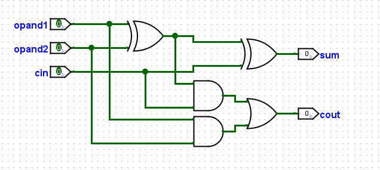
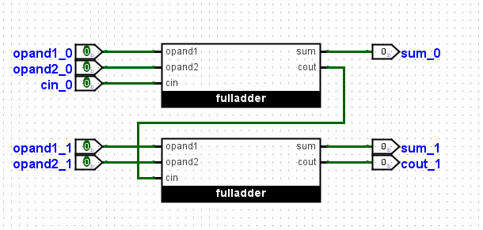
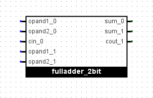
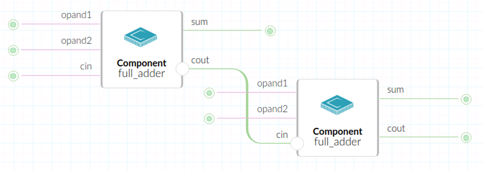
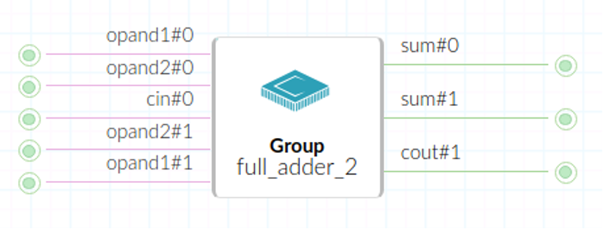
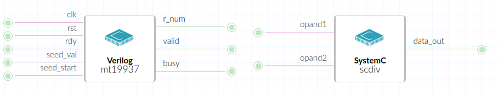
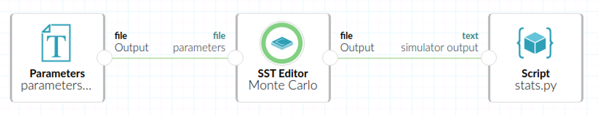

# SST Composition Tool

The SST Composition Tool (SCT) is an advanced graphical utility meticulously designed to abstract the intricate processes associated with configuring setups, validating model compatibility, executing simulations, and performing in-depth statistical analyses within the expansive [Structural Simulation Toolkit (SST)](https://sst-simulator.org/). This tool operates seamlessly within a user-friendly interface, allowing both newcomers and experienced users to harness the full potential of SST.

SCT is conceptually crafted as an [Occam](https://occam.cs.pitt.edu/) object, which can be utilized both in collaborative work environments and within private networks. What's more, SCT offers the valuable option to share and disseminate its functionality with the broader community.

## Motivation

SST, a parallel discrete event simulation framework, allows custom and vendor models to be interconnected to create a system simulation. However, SST has several barriers of entry that amplify its already steep learning curve:
- C++; SST requires models to be translated into SST Components. This means that rapid prototyping is very difficult and infrequent. Computer architecture models are often written in hardware description languages (VHDL, Verilog, SystemVerilog, etc.) or popular scripting languages (Python, Scala, etc.)
- MPI; an inherently complex but powerful concept, concurrent programming is crucial for SST’s core functionality. Common issues in this paradigm include interference, race conditions, process creation and termination, shared resources and consistency, synchronization and deadlock, etc.

SCT aims to lower this barrier of entry by abstracting away the complexity under its graphical interface. The main target users of SCT are in fact not experts of SST, but users focused on computer systems, network topologies, system simulations, high-performance computing, and other computer architecture topics. For instance, SCT users are not expected to know the intricate setup and build processes of the `MemHierarchy` Element and its SubComponents, but rather be able to use the Component to rapid prototype a cache system.

### Component Composition

In SCT, the SST configurations are represented in multi-layered workflows composed of graph layouts; nodes are SST Components are represented as nodes and SST Links as the edges. The graphical canvas is similar to [Logisim](https://github.com/logisim-evolution/logisim-evolution), where each components can be composed into groups to create a larger system. The following set of images demonstrate the modular design of Logisim:

A simple 1-bit full adder, composed of basic logic gates.

Two 1-bit full adders cascading to form a 2-bit full adder.

A simple 2-bit full adder, composed of two 1-bit full adders.

SCT is highly influenced from this modular design. It allows composition of Components into Grouped Components that can be copied, moved, and saved to create larger systems for SST to simulate.

Two simple 1-bit full adder SST Components.

The two simple 1-bit full adder SST Components being grouped into a Grouped Component.

### External Components

SCT adds support for components in external frameworks and hardware description languages. The external model is wrapped as SST Component and communication is established via inter-process communication.

Sample Components written in Verilog and SystemC.

For more information, see [SST Interoperability Tool](https://github.com/lpsmodsimteam/SIT).

### Simulation Execution

One of the main philosophy behind SCT is encapsulation of the underlying layers involved with running SST simulations. The software allows for the user to execute the SST simulation after being configured without having to leave the graphical interface.

Sample pipeline of the SST experiment being run through SCT.

## Occam

Occam is an archival toolchain designed by the University of Pittsburgh to support digital preservation of computational artifacts. SCT is currently hosted on Occam as an [Occam object](https://gitlab.com/occam-archive/occam-objects). Occam needs to be installed for SCT development.

### Live Instance

Live instances of Occam are hosted on the production server: https://occam.cs.pitt.edu/ and the (non-stable) development server: https://occam.dev/.

__Note__: The SST Framework Object on the production server is currently on version 7.1.0. The development server hosts the SST Framework Object with SST 13.0.0.

Navigate to the live instance, and create an account with Occam. Once an account is generate, navigate to the `Active` tab and create an empty SST Simulation object by clicking the `Create Object` button. Occam will redirect to the SST Simulation object and present an empty workflow with a sidebar. The sidebar will consist of all of the SST Elements installed on the server's SST instance. Drag and drop the Elements to create an SST configuration, and connect them via SST Links. Once the layout is ready, save it by clicking the `Save` icon above the sidebar, and navigate to the `History` tab to publish the object.

The SST Simulation object is now published and can be ran through an Occam Experiment. Navigate back to the `Active` tab and create a Blank Experiment. Occam will redirect to the experiment object and present an empty workflow with a sidebar. Search for the SST Simulation object that was created, drag, and drop it on the workflow canvas. The contents of the object can be viewed by clicking on the `magnifying glass` button. The parameters of the SST Elements can be modified in the configuration pane by clicking the `configuration` button. Once the parameters are finalized, run the SST experiment by navigating to the `Run` tab and running the published object.

### Development

#### Installation

Both the [Occam kernel](https://gitlab.com/occam-archive/occam) and the [Occam web client](https://gitlab.com/occam-archive/occam-web-client) need to be installed.

##### Occam Kernel

To install the Occam kernel on a Linux machine:
- Clone the Occam kernel `git clone https://gitlab.com/occam-archive/occam`
- Run the install script `sh ./install.sh`

##### Occam Web Client

To install the Occam web client on a Linux machine:
- Clone the Occam web client `git clone https://gitlab.com/occam-archive/occam-web-client`
- Run the install script `sh ./scripts/install.sh`

##### SST Framework Object

The SST Framework Object is a dependency that must be installed into Occam to allow the functionality of SST. The object can be found by navigating to the Occam server and searching for "sst" on its search box on the top right.

__Note__: The SST Framework Object on the production server is currently on version 7.1.0. The development server hosts the SST Framework Object with SST 13.0.0. It is highly recommended to use the version provided by the development server.

Once the object is located, copy the URL and pull it via the Occam kernel: `./bin/occam objects pull <OBJECT-URL>`

##### Workflow Widget

The [Workflow UI Widget](https://gitlab.com/wilkie/workflow-widget) is the main frontend component of SCT. It is a JavaScript library that Occam uses to generate the graphs necessary for an SCT layout. The library is versatile and offers numerous features to generate robust layouts, including variable numbers of ports, automatic edge connections, and custom node icons.

It is highly recommended for rapid prototyping frontend features of SCT, the widget can be used independently from Occam. To set up the example layouts:
- Clone the repository: `git clone https://gitlab.com/wilkie/workflow-widget`
- Run a local web server and navigate to the examples directory. This can be achieved in numerous ways; running a Python web server is one approach: `python -m http.server`

#### Execution

Once all of the dependencies are installed, run the kernel and the web client simultaneously.

To run the kernel, from the root directory run the binary: `./bin/occam daemon run`

To run the web client, from the root directory run the script `./start.sh`

The default port of the local instance of Occam is 9292.

## Features and Requirements

### Existing Features

The following is a non-exhaustive list of features currently supported by SCT:

- Parsing SST Elements installed on the host system from sst-info. This includes Component names, SubComponents, and port names.
- Automatically populating the sidebar with the SST Elements.
- Dragging-and-dropping Elements onto the workflow widget
- Deleting Elements from the workflow widget
- Concealing unused ports
- Connecting ports between Elements
- Generating default values and value types for ports
- Saving SST configuration layouts as SST Framework objects
- Generating SST configuration files from workflow layouts
- Running SST configuration files

### Features in Development

Development of features in SCT have been divided into 2 phases based on their priority, relevance, and complexity. The requirements are grouped into Phase 1 and Phase 2.

#### Phase 1

The following is a non-exhaustive list of Phase 1 features to be added to SCT:

- __Configurable SST Links:__ Similar to port parameters, SST Links have parameters such as link latency. These parameters can be accessed and modified by clicking on a similar `configuration` button on the edge between 2 Elements.
- __Components screenshot:__ This can be achieved by exporting the coordinates of the nodes and edges in the layout as a generated a JSON file, or as an image file.
- __Sub-layout replication:__ Ability to select a subsection of a layout and duplicating it within the layout.
- __Automatic sub-layout replication:__ Ability to replicate the number of sub-layouts in the layout without having to clone it manually. This can be achieved by selecting a sub-layout, and adding an option to multiply it by a specific amount within the layout.
- __Automatic Component replication:__ Ability to replicate the number of Components in the layout without having to drag and drop from the sidebar. This can be achieved by selecting a Component, and adding an option to multiply it by a specific amount within the layout.
- __Specify the version of SST:__ Ability to specify the version of SST to run the configuration from a list of available versions on the host system.
- __Find locally stored SST Elements:__ Use the SST installed on the user's system to find the SST Elements installed on the system.
- __Run local versions of SST:__ Use the SST installed on the user's system to run the configuration.

#### Phase 2

The following is a non-exhaustive list of Phase 2 features to be added to SCT:

- __Composition:__ Ability to group a sub-layout into a Grouped Component.
  - The Grouped Component represents its constituents in an abstract manner.
  - Its ports are the aggregate of all the ports of its constituents.
  - Only unconnected ports within its constituents will be exposed externally.
  - The Grouped Component is accessible as a selectable component in the sidebar.
  - You can replicate the Grouped Component, similar to a regular Component or a sub-layout.
  - Grouped Components can be recursively nested within itself.
- __External components:__ Support for Components written in hardware description languages, such as SystemC, PyRTL, and Verilog. This support would be an integration of the [SST Interoperability Tool](https://github.com/lpsmodsimteam/SIT).
- __Advanced command line options:__ Support advanced CLI arguments, such as splitting Components with `-n`.
